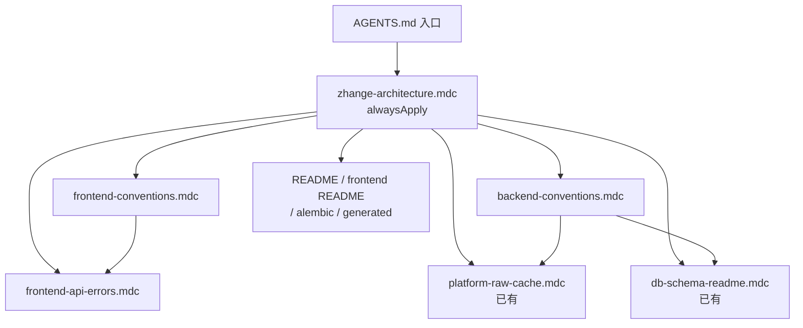

# 战鸽数据 · Agent / 开发约定治理方案

> 状态：**已落地**（2026-08-05）  
> 现行入口：[`AGENTS.md`](../AGENTS.md)、[`.cursor/rules/`](../.cursor/rules/)、[`docs/README.md`](README.md)。下文是当时的方案原文，**不要当现行规范**（例如 bind `last_checkin_*` 已删、表总览在 `docs/database.md` 不在根 README）。

## 已落地路径

| 路径 | 角色 |
|------|------|
| [`AGENTS.md`](../AGENTS.md) | 仓库总入口 |
| [`.cursor/rules/zhange-architecture.mdc`](../.cursor/rules/zhange-architecture.mdc) | alwaysApply 架构索引 |
| [`.cursor/rules/frontend-conventions.mdc`](../.cursor/rules/frontend-conventions.mdc) | 前端域规范 |
| [`.cursor/rules/backend-conventions.mdc`](../.cursor/rules/backend-conventions.mdc) | 后端域规范 |
| [`.cursor/rules/frontend-api-errors.mdc`](../.cursor/rules/frontend-api-errors.mdc) | apiError / `*Api` 边界 |
| [`.cursor/rules/platform-raw-cache.mdc`](../.cursor/rules/platform-raw-cache.mdc) | 已有：平台 raw / 签到 |
| [`.cursor/rules/skland-upstream.mdc`](../.cursor/rules/skland-upstream.mdc) | 森空岛官服/B服、补奖、cred（2026-08-07） |
| [`.cursor/rules/tarkov-upstream.mdc`](../.cursor/rules/tarkov-upstream.mdc) | 塔科夫图鉴只走 json.tarkov.dev（2026-09-03） |
| [`.cursor/rules/db-schema-readme.mdc`](../.cursor/rules/db-schema-readme.mdc) | 已有：Alembic |
| [`.cursor/rules/testing.mdc`](../.cursor/rules/testing.mdc) | 自测分层 / 补测门槛（2026-08-25） |

以下为原始方案正文（归档备查）。

---

## 1. 背景与目标

多轮复评后，项目已形成较清晰的架构习惯（OpenAPI 契约、签到 logs 权威、Alembic-only、client/attendance 拆分、`APP_ENV` / Redis 限流等），但约定分散在：

- 2 条 Cursor 专项规则（平台 raw、数据库）
- 根 README / 前后端 README / alembic README
- 代码 docstring 与实现细节

**缺口：** 无 `AGENTS.md`、无 always-on 架构索引、无前端/后端可执行开发规范、无强制 `apiError` / 模块边界规则。Agent 与人不一定每次加载到这些知识。

### 本方案要达成

| 目标 | 衡量 |
|------|------|
| Agent 开聊即知「改什么要遵守什么」 | alwaysApply 索引 + `AGENTS.md` 入口 |
| 改前端/后端文件时自动带上域内规范 | 按 glob 的专项 rule |
| 不与现有两条 mdc 重复打架 | 索引只引用，专项只补洞 |
| 人可维护、规则可短 | 单文件尽量 ≤80 行；细则用链接 |
| 与 CI 互补 | 规则约束「怎么写」；CI 卡住 OpenAPI drift / lint / pytest |

**非目标：** 重写 README 全文；把平台 raw / Alembic 细则再抄一遍；在未做 CSRF 前强制 JWT Cookie。

---

## 2. 原则

1. **索引短、专项深**：alwaysApply 只列「必须 / 禁止 / 去哪看」；细节放专项 rule 或现有 README。
2. **一条规则一个关注点**：避免巨型 `all-conventions.mdc`。
3. **可执行 > 愿景**：写「新 API 落 `*Api.ts`」「错误用 `apiError`」，少写「代码要优雅」。
4. **与 CI 对齐**：规则要求的动作（如 `export:openapi`）应能被现有门禁验证。
5. **先引用后新增**：`platform-raw-cache`、`db-schema-readme` 保留；新文件 `see also` 指向它们。

---

## 3. 产物清单（拟落地）

```
zhange-stats/
├── AGENTS.md                          # 人/Agent 总入口（仓库根）
└── .cursor/rules/
    ├── zhange-architecture.mdc        # alwaysApply：统一架构索引
    ├── frontend-conventions.mdc       # alwaysApply 或 frontend glob：前端规范
    ├── backend-conventions.mdc        # alwaysApply 或 backend glob：后端规范
    ├── frontend-api-errors.mdc        # globs：apiError / *Api 模块边界（可执行）
    ├── platform-raw-cache.mdc         # 已有：保留
    └── db-schema-readme.mdc           # 已有：保留
```

可选（第二期，本方案不强制首批落地）：

- `.cursor/rules/security-ops.mdc`（`APP_ENV` / 弱口令 / Redis / 邮件验证码）— 也可并入架构索引 10 行内
- 更新 `frontend/src/api/generated/README.md` 过时表述（「业务主要用手写 types」）

文档侧：本文件 `docs/agent-governance-plan.md` 作为治理方案；落地后可在文首改状态为「已落地」并链到实际文件。

---

## 4. 各产物内容大纲

### 4.1 `AGENTS.md`（仓库根）

面向：打开仓库的人或 Agent 的第一站。

建议结构：

1. **项目一句话** + 技术栈（FastAPI / React / MySQL）
2. **改代码前必读**（链接）
   - `.cursor/rules/zhange-architecture.mdc`
   - 平台数据 / 数据库两条已有规则
   - 根 README「说明」与「数据库表结构」
3. **高频命令**
   - 后端：venv、pytest、alembic
   - 前端：dev / lint / `export:openapi && gen:api`
4. **禁止清单（极短）**
   - 无迁移改表；往 `schema_ensure` 堆 ALTER
   - 签到 status 写 `last_checkin_*`；打开页必打上游
   - 页面直连 axios；手拆错误 `detail`（应用 `apiError`）
   - 未 CSRF 半改 JWT Cookie；生产开 `ALLOW_EMAIL_CODE_LOG`
5. **提交 / CI 预期**：conventional commits（若团队沿用）、三门禁含义

篇幅：约 60–100 行，不写长教程。

### 4.2 `zhange-architecture.mdc`（alwaysApply: true）

统一架构索引——**每次会话都加载**。

建议条目（bullet，可执行）：

| 域 | 必须 | 禁止 | 详见 |
|----|------|------|------|
| 契约 | 改 FastAPI schema/路由后跑 OpenAPI 导出并提交 generated | 只改手写 `types.ts` 冒充契约 | `generated/README.md` |
| 签到/盒子 | 今日 logs / raw 权威 | status 改 bind 摘要；无 force 每次回源 | `platform-raw-cache.mdc` |
| DB | Alembic + 同步 README 表结构 | 扩 `schema_ensure` | `db-schema-readme.mdc` |
| 前端 API | 域 `*Api.ts` + `apiError` | 页面直连 axios；手拆 detail | `frontend-*.mdc` |
| 后端 | api 薄、services 厚；upstream 拆 client/attendance | 巨型单文件堆逻辑 | `backend-conventions.mdc` |
| 安全 | 生产 `APP_ENV`；凭证 Fernet；QQ ticket | 弱口令默许上生产；JWT 进回调 URL | README「说明」 |
| 时间 | `timeutil` 北京墙钟 | 业务层随意 `datetime.utcnow` | `timeutil.py` |

字数控制：正文 ≤60 行。

### 4.3 `frontend-conventions.mdc`

**生效策略（推荐）：** `alwaysApply: false`，`globs: frontend/**/*.{ts,tsx}`  
（避免纯后端任务也被灌满前端细则；与 alwaysApply 索引互补。）

内容要点：

- 目录：`pages` / `components` / `api` / `stores` / `lib`
- 路由守卫：`PrivateRoute` / `AdminRoute` / `PlatformRoute`；权限看 `role`
- 状态：TanStack Query 拉远端；zustand 仅会话（auth）
- UI：沿用 Ant Design；新签到页套 `CheckinPageTemplate`
- 类型：优先 `components["schemas"][...]`；新增手写 interface 需说明为何 OpenAPI 没有
- 脚本：改 API 相关必 `npm run export:openapi && npm run gen:api`（在 backend OpenAPI 已更新的前提下）

### 4.4 `backend-conventions.mdc`

**生效策略：** `globs: backend/app/**/*.py`

内容要点：

- 分层：`api/` 参数校验与依赖注入 → `services/` 编排 → `models/`；不在路由写上游 HTTP
- Upstream：`*_client`（认证/会话/通用 HTTP）+ `*_attendance`（签到）+ 可选 `*_boxes`；对外可从 client re-export 保兼容
- 签到：状态机与 upsert 走 `checkin_common`；`apply_bind_last_checkin` 仅签到动作
- 密钥：`crypto_secret`；限流：`auth_limiter` / `platform_limiter`
- 测试：触及 security / rate_limit / checkin_common / ticket 等纯逻辑时优先补 `backend/tests`
- 迁移：同 `db-schema-readme`（此处一句话 + 链接）

### 4.5 `frontend-api-errors.mdc`（可执行模块边界）

**生效策略：**  
`globs: frontend/src/pages/**/*.tsx,frontend/src/components/**/*.tsx,frontend/src/api/**/*.ts`

**硬规则（示例表述）：**

```text
必须：
- 用户可见失败文案使用 `apiError(e, fallback)`（@/lib/apiError）
- 新接口加在对应 `frontend/src/api/*Api.ts`，由 `client.ts` 再导出（若项目已有该模式）
- HTTP 实例只用 `@/api/http` 的 client

禁止：
- 页面/组件内 `axios.create` 或裸 `fetch` 调本后端 API（上传等特例需注释说明）
- `catch (e) { message.error(e.response.data.detail) }` 一类手拆
- 在页面里复制 OpenAPI 字段形状的大型手写 interface（应 alias schema）
```

配 1 组 ❌/✅ 短代码示例（各 ≤8 行）。

---

## 5. 与现有资产的关系



| 已有 | 本方案动作 |
|------|------------|
| `platform-raw-cache.mdc` | 保留；索引引用；不改核心语义（可微调 globs 若发现漏匹配） |
| `db-schema-readme.mdc` | 保留；索引引用 |
| 根 README | 增加一小节「Agent / 开发约定」链到 `AGENTS.md`（落地时） |
| `generated/README.md` | 修订「类型以 OpenAPI 为主、手写为辅」 |

---

## 6. alwaysApply 数量策略

Cursor 对 alwaysApply 过载会稀释注意力。本方案建议：

| 文件 | alwaysApply |
|------|-------------|
| `zhange-architecture.mdc` | **true**（唯一总索引） |
| `frontend-conventions.mdc` | false + frontend globs |
| `backend-conventions.mdc` | false + backend globs |
| `frontend-api-errors.mdc` | false + 精确 globs |
| 已有两条 | 保持 false + 现有 globs |

若实践中发现纯前端任务常漏架构约束：可把架构索引保持 always，前端规范仍靠 glob（当前推荐）。

**备选（更强但更吵）：** `frontend-conventions` / `backend-conventions` 也 alwaysApply——仅当团队觉得 glob 经常漏触发时再升级。

**后续清偿：** 遗留 `apiError` 手拆已于 2026-08-05 一轮清理完成（`CompleteProfileModal` / `PhoneAuthBindTemplate` / `QqLoginButton` / `SystemUpdatePage`；孤儿组件 `ArknightsBoxPanel` 已移除；`client.ts` 不再导出 `formatRequestError`）。

---

## 7. 落地步骤（评审通过后执行）

| 阶段 | 动作 | 产出 |
|------|------|------|
| A | 写 `AGENTS.md` | 仓库根入口 |
| B | 写 `zhange-architecture.mdc` | alwaysApply 索引 |
| C | 写 `backend-conventions.mdc`、`frontend-conventions.mdc` | 域规范 |
| D | 写 `frontend-api-errors.mdc` | apiError / 模块边界 |
| E | 根 README 加链接；修正 `generated/README.md` 过时句 | 文档一致 |
| F | 本方案文首改为「已落地」并列出最终路径 | 闭环 |
| G |（可选）用一次小改动验证：Agent 是否引用规则、是否拦错误模式 | 有效性抽检 |

**不在首批：** 大范围把遗留 `formatRequestError` / 手拆 detail 全量改完（可另开「规范清偿」任务，与规则落地解耦）。

---

## 8. 未来开发如何「利用起来」

1. **默认**：开 Agent 会话 → 加载架构索引 → 按打开文件加载 frontend/backend/apiError/raw/db 规则。  
2. **人**：改功能前扫一眼 `AGENTS.md` 禁止清单；PR 描述可勾选「OpenAPI / 迁移 / apiError」。  
3. **CI**：继续用 openapi-drift、lint、vitest、pytest 做客观门禁；规则负责主观架构，CI 负责可机器验证项。  
4. **演进**：新平台接入时，只改 `platform-raw-cache` + backend 约定中的「新平台 checklist」，不扩 alwaysApply 长文。  
5. **复评画布**：工程项可标注「约定已规则化」，避免重复口头强调。

### 建议的 PR 自检清单（可粘进 AGENTS.md）

- [ ] 若改 API：已 `export:openapi && gen:api`，generated 有 diff  
- [ ] 若改模型：有 Alembic + README 表结构  
- [ ] 若改签到/盒子：符合 raw / 今日 logs 权威  
- [ ] 若改前端请求/报错：走 `*Api` + `apiError`  
- [ ] 若改生产默认：核对 `APP_ENV` / 弱口令 / `REDIS_URL` / 邮件日志开关  

---

## 9. 风险与缓解

| 风险 | 缓解 |
|------|------|
| 规则太长，Agent 忽略 | 单文件限长；索引只引用 |
| alwaysApply 过多互相矛盾 | 仅 1 个 always；专项 glob |
| 与 README 双源漂移 | README 只保留摘要 + 链接到 AGENTS/rules |
| 规则过严阻断合理特例 | 规则写「默认禁止 + 特例须注释」 |
| 只写不落地清偿 | 规则与「遗留清偿」分 PR；先防新债 |

---

## 10. 验收标准

方案落地完成当且仅当：

1. 存在 `AGENTS.md` 与第 3 节列出的 4 个新 `.mdc`（或评审后合并后的等价集合）。  
2. `zhange-architecture.mdc` 为 `alwaysApply: true`，并显式链接两条已有规则。  
3. `frontend-api-errors.mdc` 含必须/禁止 + ✅/❌ 示例。  
4. 根 README 可从「说明」或新小节跳到 `AGENTS.md`。  
5. 抽检：在前端 page 故意手写 `e.response.data.detail` 的提示下，Agent 能依据规则改为 `apiError`（人工或一次试跑）。

---

## 11. 待你确认的决策点

落地前请拍板（默认推荐已标出）：

1. **alwaysApply 范围**：仅架构索引（推荐） vs 前端+后端规范也 always  
2. **`frontend-api-errors` 独立**（推荐） vs 并入 `frontend-conventions`  
3. **是否同步改** `generated/README.md` 过时表述（推荐：是）  
4. **遗留 apiError 未统一处**：首批只加规则（推荐） vs 顺手清一轮  

确认后按第 7 节执行落地即可。

---

## 附录：拟议文件 frontmatter 草稿

```yaml
# zhange-architecture.mdc
description: 战鸽数据架构索引：契约、签到、DB、前后端边界、安全
alwaysApply: true

# frontend-conventions.mdc
description: 前端目录、路由权限、Query/zustand、OpenAPI 类型约定
globs: frontend/**/*.{ts,tsx}
alwaysApply: false

# backend-conventions.mdc
description: 后端分层、upstream 拆分、checkin_common、限流与测试
globs: backend/app/**/*.py
alwaysApply: false

# frontend-api-errors.mdc
description: 强制 apiError；禁止页面直连 axios；API 落 *Api.ts
globs: frontend/src/pages/**/*.tsx,frontend/src/components/**/*.tsx,frontend/src/api/**/*.ts
alwaysApply: false
```
